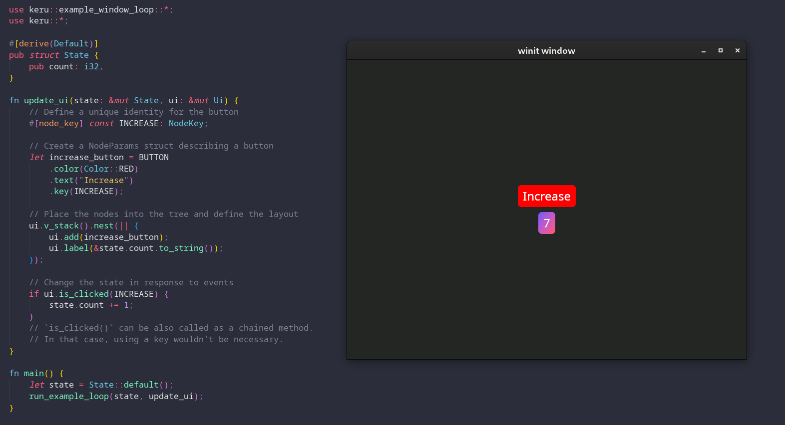
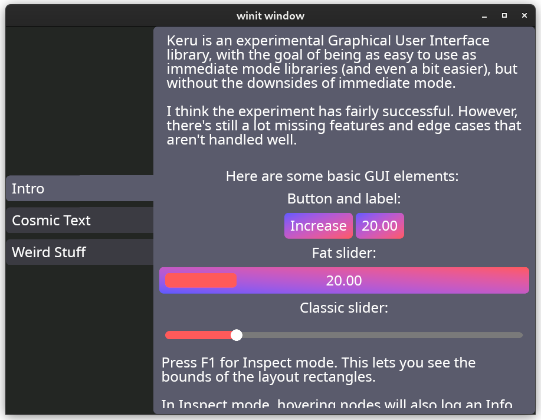
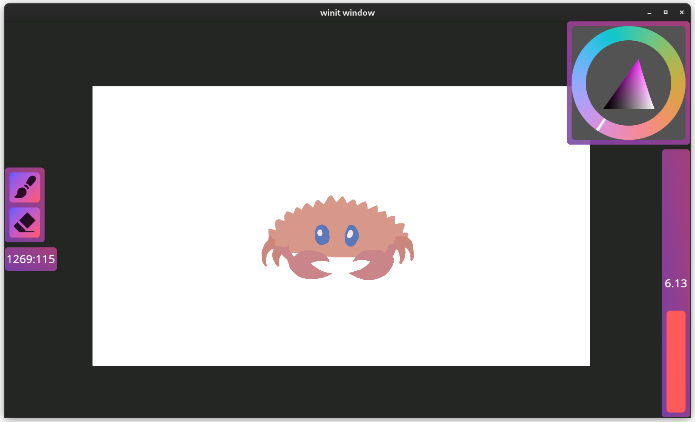

Keru is an experimental Graphical User Interface library.

The goal of the library is to be as easy to use as immediate mode libraries (and even a bit easier), but without the downsides of immediate mode.

See the [docs for the master branch](https://kekelp.github.io/keru/keru/index.html) for more information.

## Screenshots

A simple counter and the code that generates it. Examples use the `run_example_loop` helper, but the normal way to use Keru is from a user-managed `winit`/`wgpu` loop. To see how this works, see the `window_loop` example.

A showcase example with a tab viewer and some sliders:

A basic paint program. The canvas and the color picker are rendered with custom `wgpu` code.

