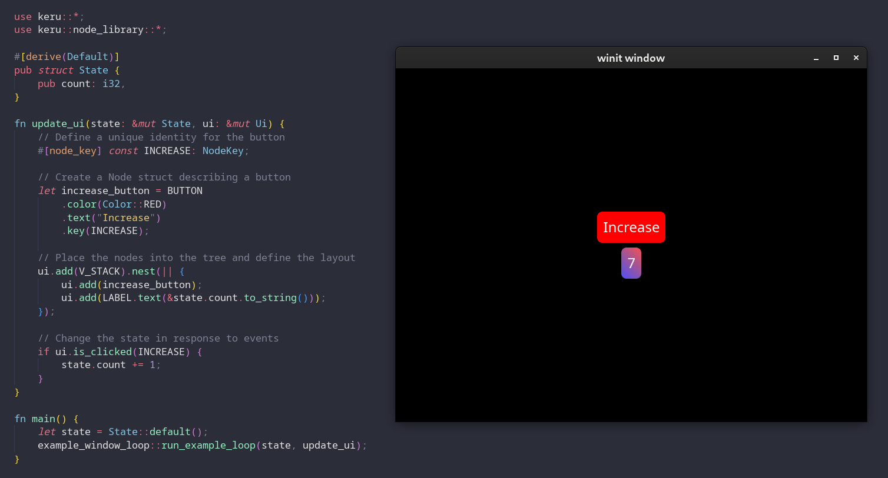
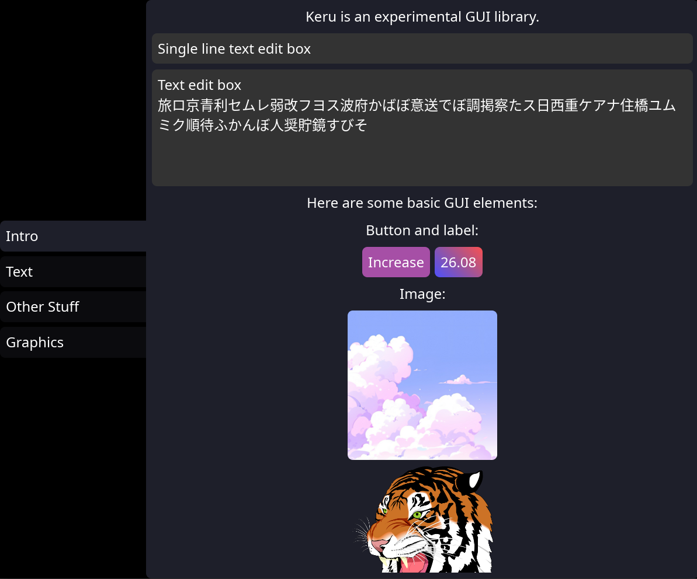
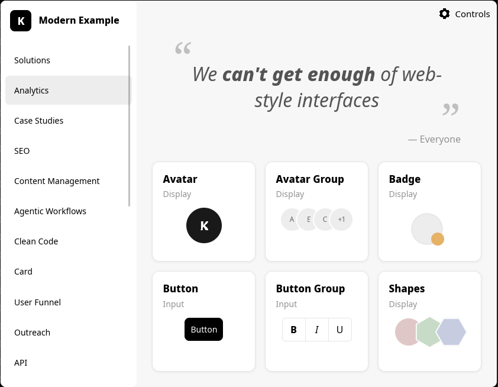
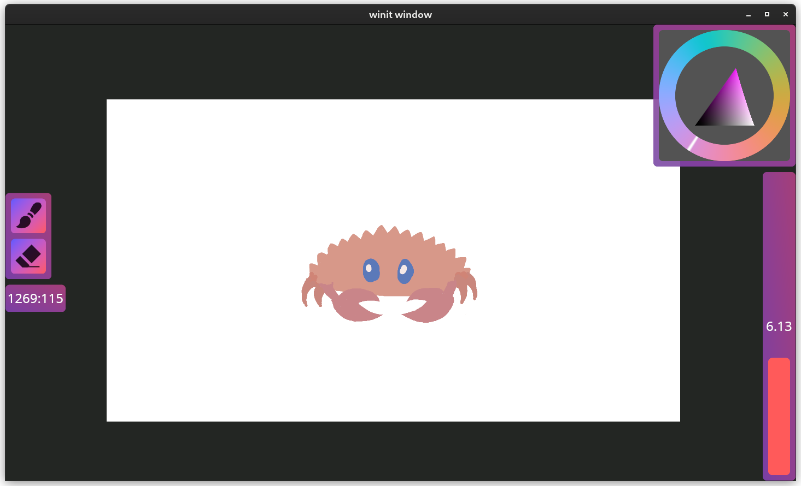

Keru is an experimental Graphical User Interface library.

See the [docs for the master branch](https://kekelp.github.io/keru/keru/index.html) for more information.

## Getting Started

The best way to get started is to clone the repository and explore the examples.

In particular, there are three heavily commented examples that serve as a tutorial:

- [`01_intro.rs`]
- [`02_dynamic.rs`]
- [`03_components.rs`]

## Screenshots

Screenshot of the [`minimal.rs`] example and its code.

Examples use the `run_example_loop` helper, but the normal way to use Keru is from a user-managed `winit`/`wgpu` loop. To see how this works, see the `window_loop` example.

Screenshot of the [`showcase.rs`] example:

Screenshot of the [`aesthetics_modern.rs`] example:

A basic paint program. The canvas and the color picker are rendered with custom `wgpu` code.

[`minimal.rs`]: https://github.com/kekelp/keru/blob/master/examples/minimal.rs
[`01_intro.rs`]: https://github.com/kekelp/keru/blob/master/examples/01_intro.rs
[`02_dynamic.rs`]: https://github.com/kekelp/keru/blob/master/examples/02_dynamic.rs
[`03_components.rs`]: https://github.com/kekelp/keru/blob/master/examples/03_components.rs
[`showcase.rs`]: https://github.com/kekelp/keru/blob/master/examples/showcase.rs
[`aesthetics_modern.rs`]: https://github.com/kekelp/keru/blob/master/examples/aesthetics_modern.rs