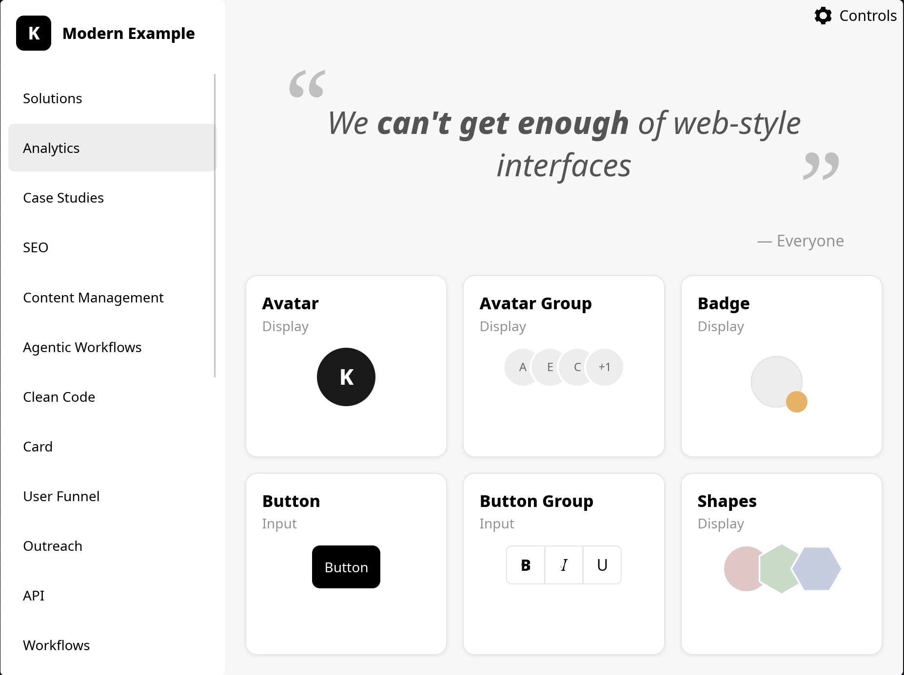

Keru is an experimental Graphical User Interface library.

See the [docs for the master branch](https://kekelp.github.io/keru/keru/index.html) for more information.

## Getting Started

The best way to get started is to clone the repository and explore the examples.

There are three heavily commented examples that act as a tutorial:

- [`01_intro.rs`]
- [`02_dynamic.rs`]
- [`03_components.rs`]

## Screenshots

Screenshot of the [`minimal.rs`] example and its code.

Examples use the `run_example_loop` helper, but the "intended" way to use the library is from a user-managed `winit`/`wgpu` loop. See the [`window_loop.rs`] example.

Screenshot of the [`showcase.rs`] example:

Screenshot of the [`aesthetics_modern.rs`] example.
(The design is heavily inspired by an example in the Vizia library).

Recording of the [`aesthetics_scifi.rs`] example. It uses a stateful `Component` to create a reusable button with a hover animation and a blinking ripple click effect.
It also uses `canvas_drawing` to draw a 3D wireframe, just for fun.

https://github.com/user-attachments/assets/7d52efdf-e668-4803-bd94-f7856481df76

Screenshot of a basic paint program. The canvas and the color picker are rendered with custom `wgpu` code.

[`01_intro.rs`]: https://github.com/kekelp/keru/blob/master/examples/01_intro.rs
[`02_dynamic.rs`]: https://github.com/kekelp/keru/blob/master/examples/02_dynamic.rs
[`03_components.rs`]: https://github.com/kekelp/keru/blob/master/examples/03_components.rs
[`minimal.rs`]: https://github.com/kekelp/keru/blob/master/examples/minimal.rs
[`window_loop.rs`]: https://github.com/kekelp/keru/blob/master/examples/window_loop.rs
[`showcase.rs`]: https://github.com/kekelp/keru/blob/master/examples/showcase.rs
[`aesthetics_modern.rs`]: https://github.com/kekelp/keru/blob/master/examples/aesthetics_modern.rs
[`aesthetics_scifi.rs`]: https://github.com/kekelp/keru/blob/master/examples/aesthetics_scifi.rs
